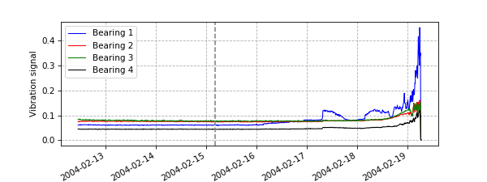
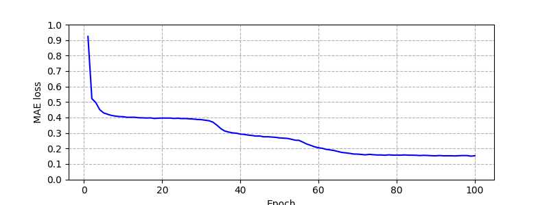
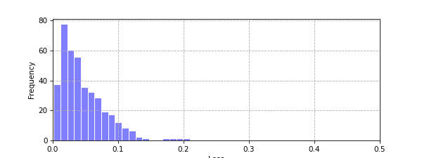
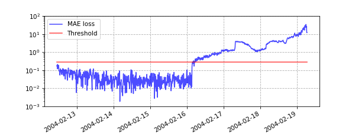

# Anomaly Detection for Bearing Failures Prediction

## Introduction

Bearings used in industry have unusual vibrations as a preliminary sign of failures. If such abnormal vibration can be detected, the bearing can be replaced before the actual failure occurs, and the equipment downtime due to failure can be kept relatively short. In this example, in order to predict future bearing failures before they occur, an autoencoder, a form of neural network, is used to build a model that identifies abnormal vibrations from continuous sensor readings for a set of bearings.

The autoencoder model is implemented using a PyTorch module, with [Brent Larzalere's Keras/TensorFlow implementation](https://github.com/BLarzalere/LSTM-Autoencoder-for-Anomaly-Detection) was used as a reference.

## Dataset

As input bearing vibration sensor readings, we used datasets contained in *NASA Acoustics and Vibration Database*. In these datasets, bearing vibrations are recorded in each file as 1 second signals per reading, and each dataset consists of a set of 1-second bearing vibrations measured continuously at 10 minute intervals. The number of files in a dataset is unspecified, as readings continue until bearing failure. Since the sampling rate of the vibration sensor is 20 kHz, each file contains 20,480 data points, since it records the vibration sensor readings for 1 second.

## Methods

### Data Loading and Preprocessing

Since bearings have abnormal vibrations before they actually fail, it is assumed that bearings undergo gradual mechanical degradation over time. Therefore, in order to perform the analysis over a wide range of time, the vibration records of 20,480 data points every 10 minutes corresponding to each file are aggregated by mean and absolute value, and treated as a single data point. The aggregated data points were combined into a single Pandas dataframe, which was used as the dataset for the analysis.

### Define Training and Test Split of the Dataset

Before training a model, the dataset is split into two parts: a training set that does not include abnormal vibrations and a test set that includes the period from abnormal vibration to failure. Here, simply assuming from the progress of time, the first 40% of the dataset, which is considered to represent normal operating conditions, was used as the training set, and the remaining 60% of the dataset after that, up to bearing failure, was used as the test set. Figure 1 shows a plot along the time axis of the aggregated readings from the vibration sensors of a set of four bearings.

**Figure 1. The aggregated readings from the sensors of the vibration of a set of four bearings. The dotted line in the figure shows the point where the training and test sets were split. It can be seen from the figure that the period of abnormal vibrations is not included in the training set.**

### Model

The autoencoder model was implmented using modules of Long Short-Term Memory, LSTM, a form of recurrent neural network, RNN in PyTorch framework. The autoencoder consists of two parts, an encoder and a decoder, which encode the input into the embedding dimension and then output by the decoder to reconstructed the input from the embedding dimension. The model performs unsupervised or self-supervised learning to reduce the loss between the input and the output. The encoders and decoders are each composed of a two-layer LSTM, with the hidden dimension set to 16 and the embedding dimension set to 4. The mean absolute error, MAE was used as the loss function.

## Results

### Unsupervised Learning

Unsupervised learning was performed using the autoencoder model to reconstruct the training set. The loss is shown in Figure 2.

**Figure 2. The history of losses from unsupervised learning on the training set.**

### Distribution of Losses

Using the trained model, losses were computed for the training set. A plot of the distribution of the losses is shown in Figure 3. This plot is used as a reference to define a suitable threshold for identifying anomalies. The threshold should be set larger than the noise level so that the abnormal vibration and the background vibration noise can be statistically significantly discriminated. If the vibration noise exceeds the threshold, it is a false positive, and if the threshold is set lower than appropriate value, it leads to increased costs due to unnecessary bearing replacements, etc.

**Figure 3. The distribution of losses computed for the training set using the trained model.**

Based on the distribution of losses on the training set, we decided to use 0.275 as the threshold for detecting anomalies. Next, the losses are calculated for the test set using the trained model to check if the output exceeds the threshold identified as abnormal. The distribution of losses for the test set is shown in Figure 4. The figure showing the distribution of losses for this model visualizes the occurrence of abnormal vibration, which is a predictor of bearing failures. The results confirm that the loss between input and output actually exceeds the defined threshold before bearing failure occurs.

**Figure 4. The history of losses against the test set.**

The approach of this analysis was to detect future bearing failures from abnormal vibrations before the actual physical failure occurs. In application, it is important to determine the optimal threshold for detecting anomalies in order to avoid detecting many false positives under normal operating conditions.
